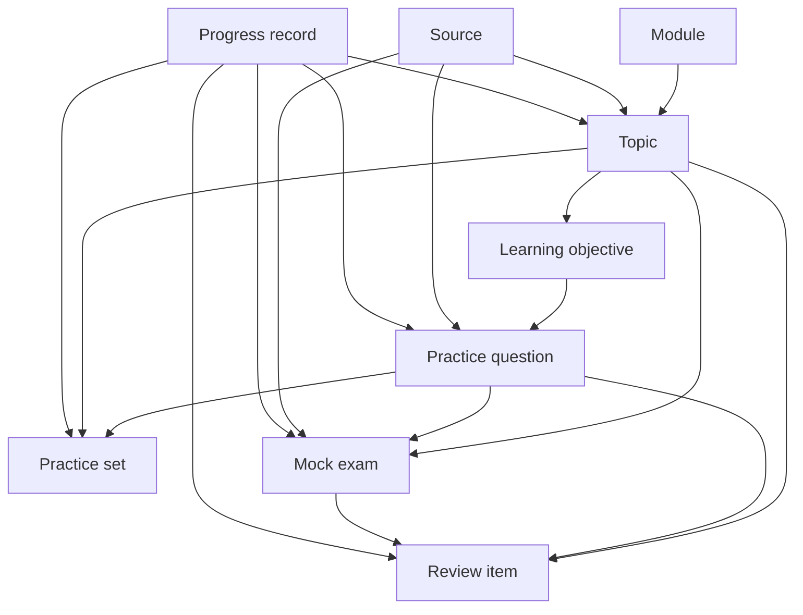
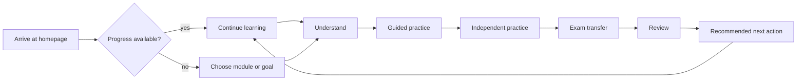

# Information Architecture

This document defines the version-one information architecture for the independent learning platform for B.Sc. Volkswirtschaftslehre students at Georg-August-Universität Göttingen.

The platform is not an official university platform. It must not imply official university affiliation, endorsement, lecturer alignment, semester alignment, exam availability, or course alignment unless explicitly sourced and current.

## 1. Architecture principles

The architecture must support this learning loop:

Understand → Guided practice → Independent practice → Exam transfer → Review

The platform must behave as a study companion, not as a document catalogue. Pages, navigation, and content relationships should help learners decide what to do next, not merely expose files or lists.

The architecture must ensure:

- new users can begin learning within two interactions
- returning users can resume in one interaction
- every published topic is reachable through module navigation or search
- every page has a clear primary action
- every learning page provides a recommended next step
- essential navigation works without client-side JavaScript
- modules use a consistent global structure
- module-specific learning components are allowed when pedagogically justified
- current and archived semester content remain distinguishable
- unpublished or incomplete material is handled honestly

All public learning content should be statically generated. JavaScript may enhance progress, search, review, and interaction, but it must not be required for essential navigation.

## 2. Complete text sitemap

```text
/
/lernen/
/lernen/[module]/
/lernen/[module]/[topic]/
/ueben/
/ueben/[module]/
/ueben/[module]/[practice-set]/
/probeklausuren/
/probeklausuren/[module]/
/probeklausuren/[module]/[exam]/
/fortschritt/
/suche/
/ueber-das-portal/
/methodik/
/quellen/
/datenschutz/
/impressum/
/fehler-melden/
```

Route slugs must be lowercase ASCII. User-facing navigation labels remain German:

- Lernen
- Üben
- Probeklausuren
- Fortschritt
- Suche

## 3. Route-family table

| Route family | Purpose | Primary CTA | JavaScript dependency | Authentication | Indexing policy |
| --- | --- | --- | --- | --- | --- |
| `/` | Personalized or stateless learning entry point | Continue learning or start session | Optional enhancement only | none | index |
| `/lernen/` | Task-oriented learning entry point | Continue or choose next lesson | Optional enhancement only | none | index |
| `/lernen/[module]/` | Module overview and learning path | Continue module | Optional enhancement only | none | index when module has published content |
| `/lernen/[module]/[topic]/` | Standard topic learning page | Start or continue topic loop | Optional enhancement only | none | index when published |
| `/ueben/` | Practice entry point | Start practice session | Optional enhancement only | none | index |
| `/ueben/[module]/` | Module practice overview | Choose practice mode | Optional enhancement only | none | index when module has practice |
| `/ueben/[module]/[practice-set]/` | Practice-set session | Start or continue set | Needed only for interactive checks | none | noindex if stateful, index if static overview |
| `/probeklausuren/` | Mock-exam entry point | Choose exam practice | Optional enhancement only | none | index |
| `/probeklausuren/[module]/` | Module exam-practice overview | Start exam practice | Optional enhancement only | none | index when content exists |
| `/probeklausuren/[module]/[exam]/` | Exam overview and attempt flow | Start timed or untimed mode | Needed for timer/submission enhancement | none | index overview, noindex attempt state |
| `/fortschritt/` | Local progress overview | Resume recommended action | Uses local storage when available | none | noindex |
| `/suche/` | Search and discovery | Search content | Optional enhancement; static fallback required | none | index |
| `/ueber-das-portal/` | Explain independence and purpose | Start learning | none | none | index |
| `/methodik/` | Explain learning method and review model | Start learning session | none | none | index |
| `/quellen/` | Source directory and trust overview | Browse sources | Optional enhancement only | none | index |
| `/datenschutz/` | Privacy information | Return to learning | none | none | index |
| `/impressum/` | Legal notice | Return to learning | none | none | index |
| `/fehler-melden/` | Error-reporting guidance | Report an error | Optional form enhancement only | none | index |

## 4. Route definitions

### `/`

- Purpose: provide the fastest useful entry into learning, review, or resumption.
- Primary user job: help me know what to learn next.
- Intended audience state: new visitor, returning learner, learner with review items due, learner who does not know where to begin.
- Required content: value proposition, resume action when available, due review summary when available, learning-session start, goal selection, module browsing, trust and methodology links.
- Primary CTA: continue learning when progress exists; otherwise start a learning session.
- Secondary CTA: choose a learning goal.
- Breadcrumb behaviour: no breadcrumb on the homepage.
- Empty state: if no progress exists, show a stateless start path and available modules.
- JavaScript dependency: none for core content; optional for reading local progress.
- Authentication requirement: none.
- Indexing policy: index.
- Canonical behaviour: canonical URL is `/`.
- Relationship to progress tracking: reads local progress if safely available; must function without it.
- Relationship to search: links to `/suche/` and may surface common discovery paths.

### `/lernen/`

- Purpose: task-oriented learning entry point, not merely a module directory.
- Primary user job: help me choose or continue the next lesson.
- Intended audience state: new visitor, returning learner, learner searching broadly, learner who does not know where to begin.
- Required content: continue last lesson, module selection, topic selection, learning-objective selection, prerequisite indicators, published/upcoming distinctions, recommended next lesson.
- Primary CTA: continue learning or start recommended lesson.
- Secondary CTA: browse modules.
- Breadcrumb behaviour: `Startseite > Lernen`.
- Empty state: explain when no modules are published and link to methodology and sources.
- JavaScript dependency: none for navigation; optional for local progress personalization.
- Authentication requirement: none.
- Indexing policy: index.
- Canonical behaviour: canonical URL is `/lernen/`.
- Relationship to progress tracking: may personalize resume and recommendations from local progress.
- Relationship to search: exposes published modules and topics to search; links to `/suche/`.

### `/lernen/[module]/`

- Purpose: provide a module identity, learning path, and next action.
- Primary user job: help me understand this module path and continue productively.
- Intended audience state: learner choosing a module, returning learner, exam-focused learner.
- Required content: module identity, course-alignment metadata, current or archived semester status, source-review status, progress summary, continue-learning action, learning path, topic list, practice access, mock-exam access, formula or reference access where relevant, source and methodology information, error-reporting action.
- Primary CTA: continue module.
- Secondary CTA: start practice for this module.
- Breadcrumb behaviour: `Startseite > Lernen > [Module label]`.
- Empty state: if the module has no published topics, show module status, available alternatives, and no false links.
- JavaScript dependency: none for module content; optional for progress summary.
- Authentication requirement: none.
- Indexing policy: index when the module has published content; noindex for planned-only shells.
- Canonical behaviour: canonical route uses stable lowercase ASCII module slug.
- Relationship to progress tracking: aggregates local topic, practice, review, and exam progress by module.
- Relationship to search: module, topic titles, objectives, formulas, and sources are searchable when published.

### `/lernen/[module]/[topic]/`

- Purpose: deliver a standard topic learning experience through the full learning loop.
- Primary user job: help me understand, practice, transfer, review, and know the next step.
- Intended audience state: active learner, returning learner, search-driven learner, exam-focused learner.
- Required content: breadcrumb, topic title and metadata, learning objectives, intuitive introduction, prerequisites, core explanation, definitions, formula/model/graph/legal structure/decision framework where applicable, worked example, common mistakes, guided practice, independent practice, exam recognition or transfer guidance, self-check, review prompts, sources and review metadata, previous/next navigation, recommended next action.
- Primary CTA: continue the topic loop at the next incomplete stage.
- Secondary CTA: practice this topic.
- Breadcrumb behaviour: `Startseite > Lernen > [Module label] > [Topic label]`.
- Empty state: missing or unpublished topics must explain status and link back to the module path or search.
- JavaScript dependency: none for reading and navigation; optional for self-checks, progress, and review scheduling.
- Authentication requirement: none.
- Indexing policy: index when published; noindex when unpublished, withdrawn, or superseded without public value.
- Canonical behaviour: canonical route uses stable module and topic slugs backed by stable IDs independent of titles.
- Relationship to progress tracking: records lesson completion, practice milestones, self-check state, review scheduling, and next recommended action when storage is available.
- Relationship to search: every published topic must appear in module navigation or search.

### `/ueben/`

- Purpose: provide a practice entry point across modules and practice modes.
- Primary user job: help me choose the right kind of practice.
- Intended audience state: learner ready to practice, learner with due review, exam-focused learner.
- Required content: guided practice, topic practice, mixed practice, timed exam practice, mistake review, due review, module filters, status of available sets.
- Primary CTA: start recommended practice.
- Secondary CTA: choose module practice.
- Breadcrumb behaviour: `Startseite > Üben`.
- Empty state: if no practice sets exist, explain what is available in learning content and link to `/lernen/`.
- JavaScript dependency: none for mode selection; optional for interactive attempts.
- Authentication requirement: none.
- Indexing policy: index.
- Canonical behaviour: canonical URL is `/ueben/`.
- Relationship to progress tracking: uses local progress to recommend modes, mistakes, and due review when available.
- Relationship to search: practice sets and questions are searchable when published or publicly listed.

### `/ueben/[module]/`

- Purpose: collect practice options for one module.
- Primary user job: help me practice within a chosen module.
- Intended audience state: module learner, returning learner, exam-focused learner.
- Required content: module practice overview, practice modes, available practice sets, topic filters, difficulty indicators, provenance summary, progress summary.
- Primary CTA: start recommended module practice.
- Secondary CTA: return to module learning path.
- Breadcrumb behaviour: `Startseite > Üben > [Module label]`.
- Empty state: if module practice is unavailable, explain status and link to published learning topics.
- JavaScript dependency: none for selection; optional for progress-based recommendation.
- Authentication requirement: none.
- Indexing policy: index when practice exists; noindex for planned-only practice pages.
- Canonical behaviour: canonical route uses stable module slug.
- Relationship to progress tracking: summarizes module attempts, correctness, and due review.
- Relationship to search: exposes practice sets by module, topic, objective, and provenance.

### `/ueben/[module]/[practice-set]/`

- Purpose: host a specific practice-set overview and session.
- Primary user job: help me complete a bounded practice activity.
- Intended audience state: active practice learner, learner reviewing mistakes, exam-focused learner.
- Required content: practice-set title, module, linked topics, learning objectives, mode, difficulty, provenance, attempt state, hints, solution availability, completion criteria, next action.
- Primary CTA: start or continue practice set.
- Secondary CTA: review linked topic.
- Breadcrumb behaviour: `Startseite > Üben > [Module label] > [Practice set label]`.
- Empty state: if the set is unavailable, explain whether it is planned, in review, withdrawn, or archived and link to alternatives.
- JavaScript dependency: static overview must work without JavaScript; interactive answer checking may require enhancement.
- Authentication requirement: none.
- Indexing policy: noindex for stateful attempt screens; index static overviews only when useful.
- Canonical behaviour: canonical route represents the practice-set overview, not transient attempt state.
- Relationship to progress tracking: records attempts, correctness, hints used, completion, mistakes, and review scheduling locally when available.
- Relationship to search: practice-set overview and public metadata are searchable; individual unpublished questions are excluded.

### `/probeklausuren/`

- Purpose: provide exam-style practice entry without implying official exam availability.
- Primary user job: help me prepare for exam conditions or exam-style transfer.
- Intended audience state: learner preparing for a specific exam, learner seeking transfer practice.
- Required content: module selection, provenance explanation, available official/adapted/original exam practice, timed and untimed mode explanation.
- Primary CTA: choose exam practice.
- Secondary CTA: review weak topics.
- Breadcrumb behaviour: `Startseite > Probeklausuren`.
- Empty state: if no mock exams are available, explain that no exam practice is published and link to topic practice.
- JavaScript dependency: none for overview; optional for timer and submission.
- Authentication requirement: none.
- Indexing policy: index.
- Canonical behaviour: canonical URL is `/probeklausuren/`.
- Relationship to progress tracking: may summarize local mock-exam attempts.
- Relationship to search: mock exams are searchable by module, provenance, and linked topics when published.

### `/probeklausuren/[module]/`

- Purpose: collect exam-style practice for one module.
- Primary user job: help me choose an exam-practice activity for a module.
- Intended audience state: exam-focused learner, returning learner.
- Required content: module exam-practice overview, provenance labels, availability, timed/untimed options, weak-topic links, source and trust notes.
- Primary CTA: start recommended exam practice.
- Secondary CTA: practice weak topics.
- Breadcrumb behaviour: `Startseite > Probeklausuren > [Module label]`.
- Empty state: if no exam practice exists for the module, explain status and link to module practice.
- JavaScript dependency: none for overview; optional for personalization.
- Authentication requirement: none.
- Indexing policy: index when exam-practice content exists.
- Canonical behaviour: canonical route uses stable module slug.
- Relationship to progress tracking: aggregates mock-exam performance and weak-topic signals.
- Relationship to search: exposes published exam-practice items and provenance.

### `/probeklausuren/[module]/[exam]/`

- Purpose: provide an exam overview and attempt flow.
- Primary user job: help me attempt, review, and learn from exam-style practice.
- Intended audience state: learner preparing for a specific exam.
- Required content: exam provenance, source status, linked module and topics, instructions, timed and untimed modes, start state, submission state, results state, solution review, weak-topic links, next recommended activity.
- Primary CTA: start timed or untimed attempt.
- Secondary CTA: review related topics.
- Breadcrumb behaviour: `Startseite > Probeklausuren > [Module label] > [Exam label]`.
- Empty state: unavailable exams must explain status and avoid implying legal access to official exams.
- JavaScript dependency: static overview works without JavaScript; timer, submission, and scoring may require enhancement.
- Authentication requirement: none.
- Indexing policy: index overview when published; noindex transient attempt/result state.
- Canonical behaviour: canonical route is the overview page.
- Relationship to progress tracking: records attempt mode, score where available, weak topics, completed review, and next activity locally.
- Relationship to search: exam metadata and linked topics are searchable when published.

### `/fortschritt/`

- Purpose: show locally stored learning state and recommended next action.
- Primary user job: help me resume, review, or understand my progress.
- Intended audience state: returning learner, learner with due review, learner preparing for exams.
- Required content: last activity, lesson completion, guided-practice completion, independent attempts, correctness, review status, mock-exam performance, recommended next action, storage-state messages.
- Primary CTA: resume recommended action.
- Secondary CTA: review due items.
- Breadcrumb behaviour: `Startseite > Fortschritt`.
- Empty state: if no progress exists or storage is unavailable, explain that progress is stored locally and link to start learning.
- JavaScript dependency: local progress display uses JavaScript, but the page must provide useful fallback links without it.
- Authentication requirement: none.
- Indexing policy: noindex.
- Canonical behaviour: canonical URL is `/fortschritt/`.
- Relationship to progress tracking: primary route for reading local progress; never requires accounts.
- Relationship to search: links to search but should not expose private local progress to search.

### `/suche/`

- Purpose: help learners find content by module, topic, concept, definition, formula, question topic, mock exam, or source title.
- Primary user job: help me find a specific concept or learning item.
- Intended audience state: learner searching for a specific concept, returning learner, exam-focused learner.
- Required content: search input, grouped results, static fallback or browsable index, result metadata, no-results guidance.
- Primary CTA: open best matching result.
- Secondary CTA: browse learning modules.
- Breadcrumb behaviour: `Startseite > Suche`.
- Empty state: no results should suggest alternate terms, module browsing, and error reporting when appropriate.
- JavaScript dependency: enhanced search may use JavaScript; essential discovery must have a non-JavaScript fallback.
- Authentication requirement: none.
- Indexing policy: index the search entry page, not query-result variants unless intentionally static.
- Canonical behaviour: canonical URL is `/suche/`.
- Relationship to progress tracking: may optionally rank recent module content locally, but must not depend on progress.
- Relationship to search: primary search route.

### `/ueber-das-portal/`

- Purpose: explain the portal purpose, independence, scope, and limitations.
- Primary user job: help me understand what this platform is.
- Intended audience state: new visitor, trust-checking learner.
- Required content: independent status, product promise, version-one scope, non-goals, link to method and sources.
- Primary CTA: start learning.
- Secondary CTA: read methodology.
- Breadcrumb behaviour: `Startseite > Über das Portal`.
- Empty state: not applicable.
- JavaScript dependency: none.
- Authentication requirement: none.
- Indexing policy: index.
- Canonical behaviour: canonical URL is `/ueber-das-portal/`.
- Relationship to progress tracking: none.
- Relationship to search: searchable as trust information.

### `/methodik/`

- Purpose: explain the learning loop, review model, progress interpretation, and source-checking method.
- Primary user job: help me understand how to study with the platform.
- Intended audience state: new visitor, learner choosing a method, trust-checking learner.
- Required content: Understand → Guided practice → Independent practice → Exam transfer → Review, progress dimensions, review behavior, content integrity workflow.
- Primary CTA: start a learning session.
- Secondary CTA: browse sources.
- Breadcrumb behaviour: `Startseite > Methodik`.
- Empty state: not applicable.
- JavaScript dependency: none.
- Authentication requirement: none.
- Indexing policy: index.
- Canonical behaviour: canonical URL is `/methodik/`.
- Relationship to progress tracking: explains progress; does not require stored data.
- Relationship to search: searchable as methodology content.

### `/quellen/`

- Purpose: expose source directory and trust model.
- Primary user job: help me understand what content is based on.
- Intended audience state: trust-checking learner, search-driven learner.
- Required content: source list, source locators, verification states, related modules/topics, source conflict notes where applicable.
- Primary CTA: browse related learning content.
- Secondary CTA: report a source issue.
- Breadcrumb behaviour: `Startseite > Quellen`.
- Empty state: if no sources are published, explain that no source-checked content is available yet.
- JavaScript dependency: none for browsing; optional filtering.
- Authentication requirement: none.
- Indexing policy: index.
- Canonical behaviour: canonical URL is `/quellen/`.
- Relationship to progress tracking: none.
- Relationship to search: source titles and linked pages are searchable.

### `/datenschutz/`

- Purpose: explain privacy, local storage, and absence of accounts in version one.
- Primary user job: help me understand what data is stored.
- Intended audience state: any learner, trust-checking visitor.
- Required content: local storage explanation, no accounts, no cloud synchronization, storage clearing behavior, error-reporting privacy notes.
- Primary CTA: return to learning.
- Secondary CTA: read methodology.
- Breadcrumb behaviour: `Startseite > Datenschutz`.
- Empty state: not applicable.
- JavaScript dependency: none.
- Authentication requirement: none.
- Indexing policy: index.
- Canonical behaviour: canonical URL is `/datenschutz/`.
- Relationship to progress tracking: explains local progress storage.
- Relationship to search: searchable as trust/legal information.

### `/impressum/`

- Purpose: provide legal notice.
- Primary user job: help me identify responsible party information.
- Intended audience state: any visitor.
- Required content: legally required notice content when available.
- Primary CTA: return to learning.
- Secondary CTA: read privacy information.
- Breadcrumb behaviour: `Startseite > Impressum`.
- Empty state: not applicable.
- JavaScript dependency: none.
- Authentication requirement: none.
- Indexing policy: index.
- Canonical behaviour: canonical URL is `/impressum/`.
- Relationship to progress tracking: none.
- Relationship to search: searchable as legal information.

### `/fehler-melden/`

- Purpose: let users report academic, technical, accessibility, or source issues.
- Primary user job: help me report a possible error.
- Intended audience state: any learner, especially trust-checking users and learners who found a possible content problem.
- Required content: issue categories, what details to include, links back to page/source context, privacy note, fallback contact method.
- Primary CTA: report an error.
- Secondary CTA: return to previous learning page.
- Breadcrumb behaviour: `Startseite > Fehler melden`.
- Empty state: if enhanced reporting is unavailable, provide a plain fallback instruction.
- JavaScript dependency: none for guidance; optional for enhanced forms.
- Authentication requirement: none.
- Indexing policy: index.
- Canonical behaviour: canonical URL is `/fehler-melden/`.
- Relationship to progress tracking: may link error context locally but must not require stored progress.
- Relationship to search: searchable as support/trust information.

## 5. Homepage architecture

The homepage must not become a long project explanation page. It should be a functional entry point that routes students into learning quickly.

For returning learners, priority order is:

1. Continue learning
2. Due review items
3. Current module progress
4. Choose another learning goal
5. Browse modules
6. Trust and methodology

For new learners, priority order is:

1. Clear value proposition
2. Start a learning session
3. Choose a learning goal
4. Recommended or available modules
5. How the learning system works
6. Trust and methodology

When local progress is unavailable, corrupted, cleared, or blocked, the homepage must fall back to the new-learner structure and make the stateless learning path obvious.

## 6. Learning-area architecture

`/lernen/` is a task-oriented learning entry point, not merely a module directory.

It must support:

- continuing the last lesson
- choosing a module
- choosing a topic
- selecting a learning objective
- identifying prerequisites
- seeing published and upcoming content clearly
- finding the recommended next lesson

The page should organize choices around learner intent: start, continue, fill a prerequisite gap, prepare for an exam, or browse a module path.

## 7. Module-page architecture

Every module page must provide:

- module identity
- course-alignment metadata
- current or archived semester status
- source-review status
- progress summary
- continue-learning action
- learning path
- topic list
- practice access
- mock-exam access
- formula or reference access where relevant
- source and methodology information
- error-reporting action

Content states for module topics are:

- available
- in review
- planned
- archived

Unavailable topics must not use disabled links. They should be communicated with plain status text, expected content type when known, and a useful next action such as "continue with the previous available topic", "practice available topics", or "check the module overview". A planned topic should not look clickable unless it has a real explanatory page.

Partially available modules should separate available learning paths from planned or in-review material. Archived material should remain reachable when useful, but it must be visibly marked as archived.

## 8. Topic-page architecture

Every standard topic page must support this order:

1. Breadcrumb
2. Topic title and metadata
3. Learning objectives
4. Intuitive introduction
5. Prerequisites
6. Core explanation
7. Definitions
8. Formula, model, graph, legal structure, or decision framework
9. Worked example
10. Common mistakes
11. Guided practice
12. Independent practice
13. Exam recognition or transfer guidance
14. Self-check
15. Review prompts
16. Sources and review metadata
17. Previous and next navigation
18. Recommended next action

Mandatory for every published topic:

- breadcrumb
- topic title and metadata
- learning objectives
- core explanation
- sources and review metadata
- previous and next navigation where adjacent published content exists
- recommended next action

Mandatory when academically relevant:

- definitions
- formulas, models, graphs, legal structures, or decision frameworks
- worked examples
- common mistakes
- guided practice
- independent practice
- exam recognition or transfer guidance
- review prompts

Parts may vary by module type. A quantitative economics topic may require formulas, graphs, model assumptions, and numerical worked examples. A legal, institutional, or policy topic may require legal structures, decision frameworks, definitions, and case-like examples. No page may invent academic material to satisfy a template slot.

## 9. Practice architecture

Practice modes are:

- guided practice
- topic practice
- mixed practice
- timed exam practice
- mistake review
- due review

| Practice mode | User intent | Entry route | Required metadata | Progress effect | Completion state | Next action |
| --- | --- | --- | --- | --- | --- | --- |
| Guided practice | Learn how to solve with support | `/lernen/[module]/[topic]/` or `/ueben/[module]/[practice-set]/` | module, topic, objective, difficulty, provenance, hints, solution status | guided-practice completion, hints used, self-check | all guided steps attempted or marked complete | independent practice for same topic |
| Topic practice | Practice one topic independently | `/ueben/[module]/[practice-set]/` | module, topic, objectives, difficulty, provenance, solution status | attempts, correctness, mistakes, confidence | target question count or set completion | review mistakes or continue topic path |
| Mixed practice | Combine multiple topics | `/ueben/[module]/[practice-set]/` | module, topics, objectives, difficulty mix, provenance | attempts, correctness by topic, weak-topic signals | set completed or stopped with summary | weak-topic review |
| Timed exam practice | Simulate exam pressure | `/probeklausuren/[module]/[exam]/` | module, exam provenance, duration, topics, solution status | timed attempt, score where available, weak topics | submitted or time ended | solution review |
| Mistake review | Revisit previous errors | `/ueben/` or `/fortschritt/` | previous attempts, linked topics, common errors | mistake resolved, review status updated | mistakes answered or dismissed | due review or topic refresher |
| Due review | Review scheduled material | `/ueben/` or `/fortschritt/` | review items, due dates or due state, linked content | review completion, reset/suspend state | due queue completed or stopped | continue learning |

Questions relate to:

- modules through stable module IDs
- topics through stable topic IDs
- learning objectives through stable objective IDs
- difficulty through explicit labels or ordered levels
- provenance through official, adapted, or original labels
- attempts through local attempt records
- correctness through checked answers or self-reported outcomes
- hints through availability and hints-used tracking
- solutions through source-checked or clearly original solution metadata
- common errors through linked explanation records
- review scheduling through review-item relationships

Hints and solutions must never imply source-checked status unless verified. Original exercises and solutions must be clearly labeled as original.

## 10. Mock-exam architecture

Mock-exam content must distinguish among:

- official exam: published only when legal availability and source status are clear
- adapted exam: based on official or source material but modified, with changes disclosed
- original mock exam: created for the platform and never presented as official

All exam practice requires unambiguous provenance labels. The platform must not assume official exams are legally available for publication.

Exam architecture must include:

- exam overview page: provenance, source status, linked module/topics, mode options, and limitations
- start state: choose timed or untimed mode and confirm readiness
- timed and untimed modes: same academic content where applicable, different time behavior
- submission state: explicit completion action or automatic timeout for timed mode
- results state: score or qualitative result where answer checking exists
- solution review: source-checked solutions or clearly labeled original explanations
- weak-topic links: links back to relevant topics and practice
- next recommended activity: review, weak-topic practice, or another exam set

Transient attempt and result states should not be indexed.

## 11. Progress architecture

Progress is a set of separate dimensions, not one vague percentage.

Progress dimensions include:

- lesson completion
- guided-practice completion
- independent attempts
- independent correctness
- review status
- mock-exam performance
- last activity
- recommended next action

Version one may store local progress data in browser storage:

- last visited module and topic
- completed lesson sections or topic completion
- guided-practice completion
- practice attempts and correctness summaries
- due, upcoming, completed, suspended, or reset review items
- mock-exam attempts and weak-topic summaries
- bookmarked concepts
- explicitly scheduled review items

Progress behavior:

- No progress exists: show a stateless start path and available modules.
- Local storage is unavailable: explain that progress cannot be saved locally and keep learning navigation usable.
- Local storage is corrupted: ignore unsafe data, offer reset, and provide stateless navigation.
- Progress has been cleared: behave like a new learner without presenting an error.
- Content IDs change: preserve records only when stable IDs map cleanly; otherwise show a recovery message and avoid false completion.
- A topic is archived or superseded: keep historical progress visible when possible, mark content status clearly, and recommend the current replacement when available.

Local progress must never be the only route to public learning content.

## 12. Review architecture

Review items are created from:

- self-check answers
- incorrectly answered questions
- bookmarked concepts
- formulas
- definitions
- explicitly scheduled review items

Review item states are:

- due
- upcoming
- completed
- suspended
- reset

The review model should define product behavior and data relationships only. Version one must not prescribe a complex spaced-repetition algorithm yet.

Review items must link back to their source content: module, topic, objective, formula, definition, practice question, or mock-exam weak-topic signal. Review sessions should offer a bounded queue, a completion state, and a clear next action.

## 13. Search architecture

Search must support:

- module names
- topic titles
- concepts
- definitions
- formulas
- question topics
- mock exams
- source titles

Result groups are:

- learning content
- practice
- exams
- sources

Every search result should explain:

- content type
- module
- topic where applicable
- publication or review status
- destination
- relevant matching context

Unpublished content should generally be excluded from search unless there is a public explanatory placeholder with a useful next action. Archived content may appear in search when useful, but it must be clearly labeled as archived and should not outrank current published content for ordinary queries. Temporarily withdrawn content should be excluded or represented only by a status page when necessary to avoid broken links.

## 14. Trust and source architecture

The trust model defines relationships among:

- academic page
- source
- source locator
- semester
- lecturer or author when explicitly available
- verification status
- content status
- reviewer
- review date
- error report

Every published academic page must expose enough metadata for users to understand:

- what the content is based on
- whether it is official, adapted, or original
- when it was last reviewed
- whether it matches a current or archived course version
- how to report a possible error

The platform must clearly state that it is not an official university platform.

No lecturer, author, semester, exam, source, or course-alignment detail may be invented. Missing metadata should be labeled as unavailable, not guessed.

## 15. Navigation rules

Global navigation:

- contains Lernen, Üben, Probeklausuren, Fortschritt, Suche
- appears consistently across main pages
- uses semantic links
- does not require JavaScript

Contextual module navigation:

- appears on module and module-related pages
- links to module overview, topics, practice, exam practice, sources, and relevant references when available
- distinguishes current, archived, planned, and in-review content

Breadcrumbs:

- show hierarchy from homepage to the current page
- use real links for available ancestors
- do not include disabled links

Previous and next navigation:

- appears on published topic pages where adjacent published content exists
- follows the learning path, not alphabetical order unless explicitly chosen
- must not point to unavailable content as if it were available

Continue-learning behavior:

- uses local progress when available
- falls back to recommended first available lesson when progress is missing
- never requires an account

Back behavior:

- should use ordinary browser behavior and visible navigation links
- should not depend on custom JavaScript history controls for essential movement

Mobile navigation:

- must fit and operate at 320 CSS pixels
- must avoid hover-dependent access
- must keep essential routes reachable

Footer navigation:

- includes trust, methodology, sources, privacy, legal notice, and error reporting
- does not duplicate the global navigation in a competing way

Avoid:

- duplicate competing navigation systems
- hidden essential navigation
- navigation dependent on hover
- excessive sticky UI
- deep route nesting beyond what is necessary

## 16. Navigation hierarchy

```text
Startseite
├── Lernen
│   ├── Module overview
│   ├── Module page
│   │   └── Topic page
│   └── Learning-objective paths
├── Üben
│   ├── Module practice
│   │   └── Practice set
│   ├── Mistake review
│   └── Due review
├── Probeklausuren
│   ├── Module exam practice
│   │   └── Exam or mock exam
│   └── Weak-topic review
├── Fortschritt
│   ├── Recommended next action
│   ├── Review queue
│   └── Local progress summary
├── Suche
│   ├── Learning content results
│   ├── Practice results
│   ├── Exam results
│   └── Source results
└── Trust and legal
    ├── Über das Portal
    ├── Methodik
    ├── Quellen
    ├── Datenschutz
    ├── Impressum
    └── Fehler melden
```

## 17. Navigation-type table

| Navigation type | Where it appears | Purpose | Rules |
| --- | --- | --- | --- |
| Global | Main layout | Move among Lernen, Üben, Probeklausuren, Fortschritt, Suche | Semantic links, no JavaScript requirement, visible focus |
| Module | Module, topic, module practice, module exam pages | Keep module context and related actions visible | Show available links only; label archived/planned/in-review states |
| Topic | Topic pages | Move through learning path | Previous/next follow pedagogical sequence and skip unavailable content |
| Contextual | Practice, exams, progress, search, empty states | Offer the best next action for the current state | One clear primary action and useful secondary action |
| Footer | All public pages | Trust, legal, methodology, source, and reporting access | Stable, plain links without competing with global nav |

## 18. Page type primary CTA table

| Page type | Primary CTA |
| --- | --- |
| Homepage with progress | Continue learning |
| Homepage without progress | Start a learning session |
| Learning entry | Continue learning or start recommended lesson |
| Module page | Continue module |
| Topic page | Continue the topic loop |
| Practice entry | Start recommended practice |
| Module practice page | Start module practice |
| Practice set | Start or continue practice set |
| Exam entry | Choose exam practice |
| Module exam page | Start recommended exam practice |
| Exam overview | Start timed or untimed attempt |
| Progress page | Resume recommended action |
| Search page | Open best matching result |
| Sources page | Browse related learning content |
| Methodology page | Start a learning session |
| Error-reporting page | Report an error |

## 19. Content relationship diagram



## 20. Primary learner journey diagram



## 21. Incomplete and unpublished content

Rules:

- Planned modules: may appear in roadmap-style areas only when useful, with no false availability.
- Planned topics: should appear as status text within module context, not disabled links.
- Topics in review: may be listed with in-review status and an explanation that content is not yet published.
- Partially available modules: must clearly separate available content from planned or in-review content.
- Archived content: may remain reachable with visible archived status and links to current replacements where available.
- Superseded semester versions: must show superseded status and should not be treated as current.
- Broken source relationships: affected content should not be marked source-checked; if already published, surface a warning or withdraw until resolved.
- Temporarily withdrawn content: must explain unavailability and provide a next action.

Users must never be led to an empty page without explanation.

## 22. Error and empty states

Every empty state must provide a useful next action.

| State | Message requirement | Next action |
| --- | --- | --- |
| No learning progress | Explain that progress is local and no activity is saved yet | Start a learning session |
| No review items due | Confirm that no review is due | Continue learning or practice |
| No published modules | Explain that no modules are published yet | Read methodology or check sources |
| No practice sets | Explain practice is not available for the selected scope | Continue learning |
| No mock exams | Explain no exam practice is published and avoid implying official availability | Use topic practice |
| No search results | Explain no match and suggest broader terms | Browse modules |
| Missing topic | Explain the topic is missing, moved, unpublished, or archived | Return to module or search |
| Unavailable archived version | Explain the archive is unavailable | Open current module version if available |
| Corrupted local progress | Explain progress could not be read safely | Reset local progress or continue statelessly |
| Offline or failed enhancement scripts | Explain enhanced behavior is unavailable if visible to the user | Continue with static navigation |

## 23. Confirmed architecture decisions

- Version one uses lowercase ASCII route slugs and German user-facing navigation labels.
- The top-level product routes are `/`, `/lernen/`, `/ueben/`, `/probeklausuren/`, `/fortschritt/`, and `/suche/`.
- Trust, method, source, privacy, legal, and error-reporting pages are first-class supporting routes.
- Essential navigation must work without client-side JavaScript.
- Version one has no accounts and no authentication requirement for the defined route families.
- Progress is local, optional, and defensive.
- Makroökonomik II is the pilot module, but this document defines no actual Makroökonomik II topics.
- Unavailable topics must not be represented as disabled links.

## 24. Unresolved product decisions

- Exact naming and ordering of module learning goals.
- Exact labels for difficulty levels.
- Whether search is implemented as static generated indexes, client-side enhancement, or a hybrid.
- How much source metadata is shown inline versus behind a details section.
- Whether progress recommendations include explicit learner confidence input in the first release.
- The exact public presentation of planned content.

## 25. Risks

- Local-only progress can be lost or corrupted, so recommendations must degrade gracefully.
- Search quality may be limited without a carefully designed content index.
- Overexposing planned content could create false expectations.
- Underexplaining source status could reduce trust.
- Exam-practice pages could accidentally imply official availability if provenance labels are not strict.
- Topic templates could pressure authors to invent content for empty sections unless content integrity rules are enforced.

## 26. Decisions deliberately deferred until after the Makroökonomik II pilot

- Advanced spaced-repetition algorithm.
- Accounts and cloud synchronization.
- AI tutoring.
- Community or social features.
- Advanced gamification.
- Final search implementation strategy.
- Cross-module prerequisite graph beyond the pilot needs.
- Detailed analytics beyond local progress.

## 27. Implications for the future content schema

The future content-schema specification should define:

- stable module, topic, objective, question, source, and exam IDs
- route slugs separate from stable IDs
- content status and publication status
- current, archived, and superseded semester status
- source locators and source-verification states
- official, adapted, and original provenance labels
- topic page sections and mandatory metadata
- practice question metadata, hints, solutions, attempts, and common errors
- review item relationships to topics, objectives, formulas, definitions, questions, and exams
- progress-record shapes for local storage
- search-index fields for content type, module, topic, status, destination, and matching context
- error-report relationships to academic pages, sources, and review metadata

The schema specification should remain documentation-only until the project explicitly begins Astro scaffolding.
